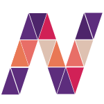

# Nex

<div align="center">
  
</div>

**Nex** is a strongly typed language designed to provide a modern approach to memory management and system-level programming. Please note that Nex is currently in the alpha stage, meaning it is actively being developed and is not yet feature-complete or stable for production use.

## Getting Started

To start using Nex, you'll need to install the Nex compiler and set up your development environment. Stay tuned for updates on installation instructions and documentation as Nex evolves.

On unix based systems: 
```sh
./build.sh

## or, 
#  python3 build.py
```

On windows:
```
py build.py
```

## Contributing

Nex is an open-source project, and contributions are welcome. If you're interested in contributing to Nex, please refer to our [contribution guidelines](CONTRIBUTING.md) for more information.

## License

Nex is licensed under the [MIT License](LICENSE.md). See the LICENSE.md file for details.

## Contact

For any questions, feedback, or support, please contact us at [contact.nexlang@gmail.com](mailto:contact.nexlang@gmail.com).
```